*** 

<br>

*** 

<p style="font-size: 18px">
Universidad de San Carlos de Guatemala
<br>
Facultad de Ingeniería
<br>
Escuela de Ciencias y Sistemas
<br>
Redes de Computadoras 1
</p>

<br><br><br><br>


<h1 align="center" style="font-size: 40px; font-weight: bold;">Practica 2</h1>

<br><br><br>

<h4 align="center" style="font-size: 30px; font-weight: bold;">Grupo 13</h4>

<br><br>


<div align="center">

| Carnet | Nombre |
| :-: | :-:| 
| 201700770 | Diego Alejandro Juarez Bran |


</div>

<br><br>

<h4 align="center" style="font-size: 18px; font-weight: bold;">Guatemala 1 de Marzo 2023</h4>


*** 
<br><br>
*** 

## Objetivos de la practica.

Que el estudiante de Redes de Computadores 1, aprenda a implementar y  desarrollar una topología de red que utiliza protocolos de capa 2 y capa 3,  configurar ruteo estático y configurar interfaces seriales.

## Desarrollo de la practica

### 1.0 Topologia utilizada
<div align="center">


</div>

### 2.0 Configuracion de Host
#### Se configuro cada host/computadora con la siguiente tabla.
<div align="center">


</div>

Donde x = numeroGrupo + ultimos 2 digitos de carnet -> x = 13 + (7+0) = 20

#### Para ingresar a la interfaz se siguen los siguiente pasos: 
<div align="center">


</div>

### Aca configuramos la IP, Getaway y Mascara de subred de cada Host de acuerdo la tabla anterior.
<div align="center">


</div>

### Repetimos este proceso para todos los host de nuestra topologia.


## 3.0 Configuracion de Routers
#### Se configuro cada Router con la siguiente tabla.
<div align="center">

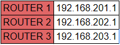

</div>

### Para ingresar a la interfaz del switch seguimos los siguientes pasos:

<div align="center">


</div>

### Ahora ingresamos los siguientes comandos:
```bash
  Router> enable
```

```bash
  Router#config t
```
```bash
  Router(config)#int fx/x
```
Donde int = interface, f = Fast Ethernet y x/x 
= Puerto donde esta conectado.
```bash
  Router(config-if)#ip address 192.168.201.1 255.255.255.0
```
Donde 192.168.201.1 = getaway y 255.255.255.0 = MascaraSubRed
```bash
   Router(config-if)#no shutdown/shut
```
<div align="center">


</div>

### Esto lo realizamos para cada router tomando en cuenta que el getaway cambia para cada uno.

## 4.0 Ping entre dispositivos.
### Para realizar un ping seguir los siguiente pasos:

<div align="center">

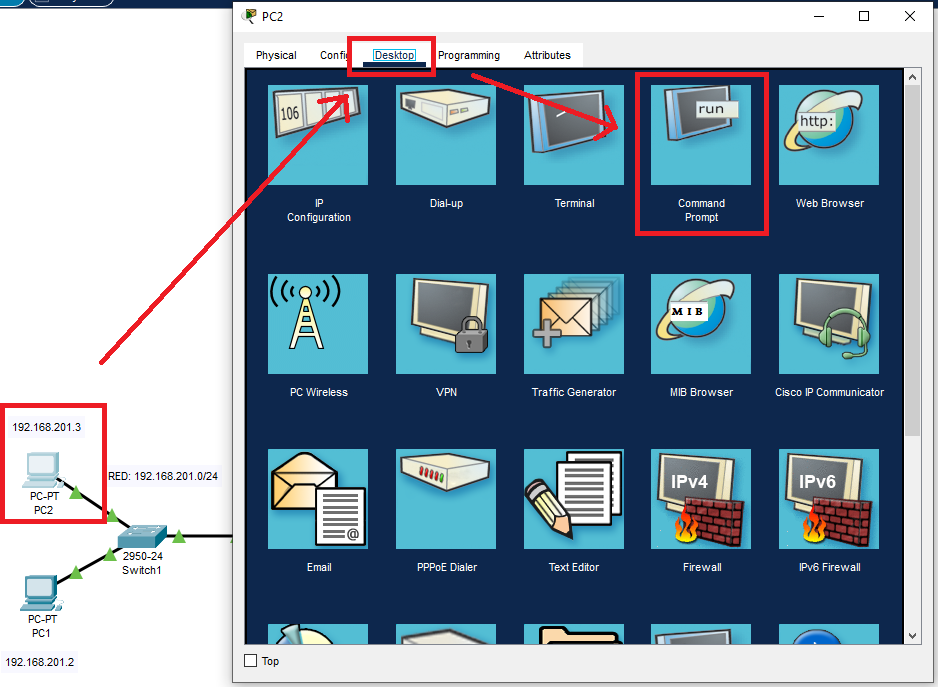

</div>

### Ahora ingresamos los siguientes comandos:
```bash
  C:\>ping 192.168.201.1
```
Donde 192.168.201.1 = Ip del dispositivo a comunicarnos.

### Ping de la PC1-Router y PC1-PC2 dentro de la RED: 192.168.201.0/24 :

<div align="center">


</div>

### Ping de la PC2-Router y PC2-PC1 dentro de la RED: 192.168.201.0/24 :

<div align="center">

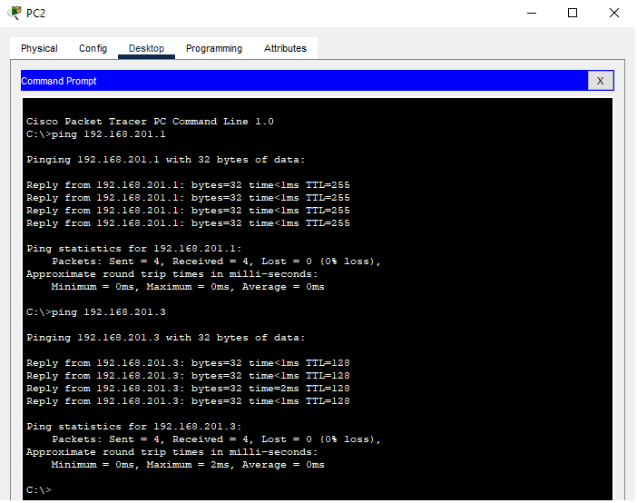

</div>

### Ping de la PC3-Router y PC3-PC4 dentro de la RED: 192.168.202.0/24 :

<div align="center">

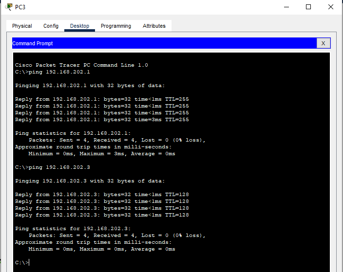

</div>

### Ping de la PC4-Router y PC4-PC3 dentro de la RED: 192.168.202.0/24 :

<div align="center">

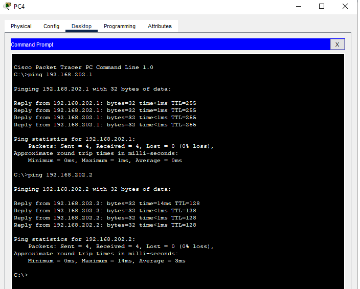

</div>

### Ping de la PC5-Router y PC5-PC6 dentro de la RED: 192.168.203.0/24 :

<div align="center">

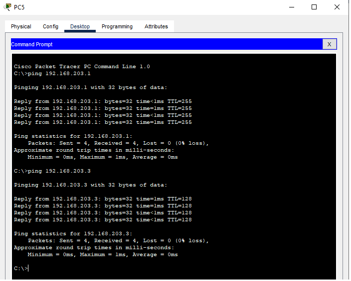

</div>


### Ping de la PC6-Router y PC6-PC5 dentro de la RED: 192.168.203.0/24 :

<div align="center">

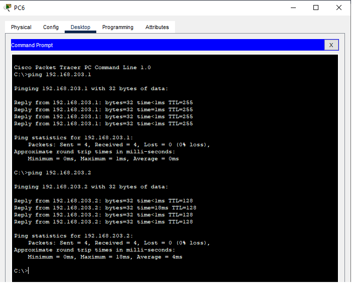

</div>

## 5.0 Levantando Intefaces
#### Se configuro cada router con la siguiente tabla.
<div align="center">

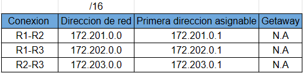

</div>

### Se configuran las intefaces para realizar el redireccionamiento de trafico ya que si estas estan apagadas no pueden establecer comunicación.

### Para ingresar a la configuracion del router seguir los siguientes pasos:
<div align="center">

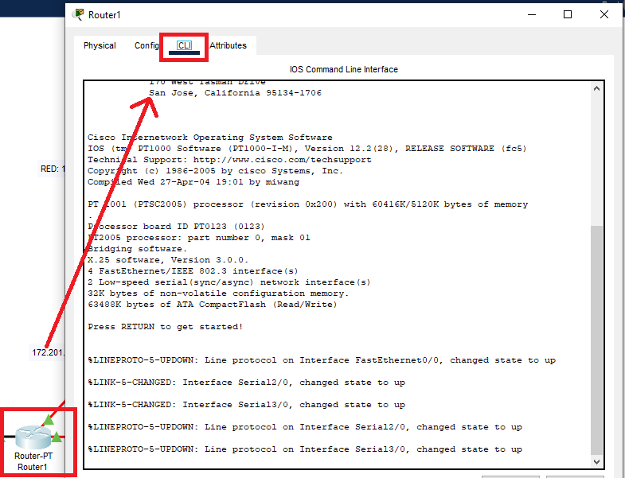

</div>


### Ahora ingresamos los siguientes comandos:
```bash
  Router> enable
```

```bash
  Router#config t
```
```bash
  Router(config)#int sx/x
```
Donde int = interface, s = Serial y x/x 
= Puerto donde esta conectado.
```bash
  Router(config-if)#ip address 172.201.0.1 255.255.0.0
```
Donde 192.168.201.1 = Direccion de red y 255.255.0.0 = MascaraSubRed
```bash
  Router(config-if)#no shutdown
```

### Estos pasos se debe de realizar 2 veces para comunicar del Router1-Router2 y Router1-Router3.

<div align="center">

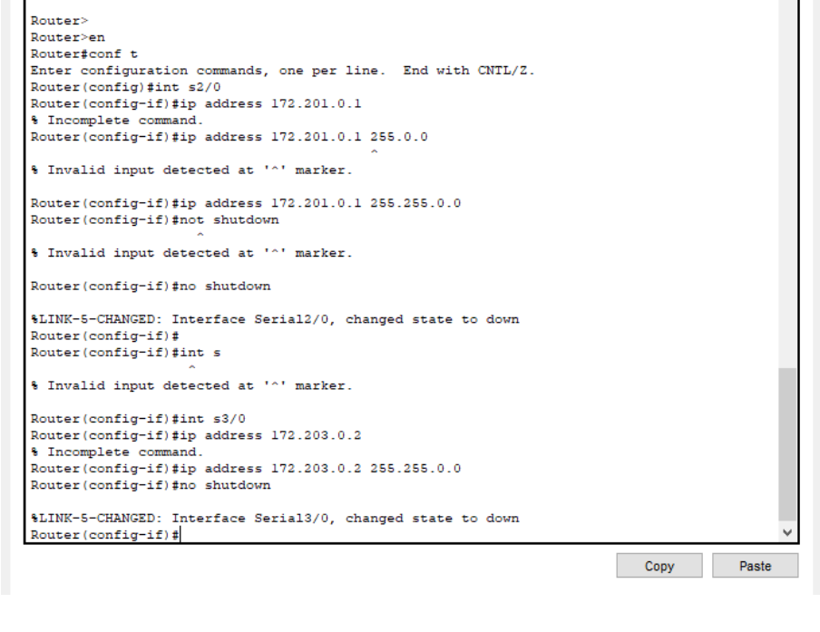

</div>

### Esto se repite para los 2 router restante tomando en cuenta que la direccion de red cambia para cada uno al igual que el puerto donde esta conectado.

## 6.0 Ruteo Estatico

### El ruteo estatico no es mas que definir una ruta y configurar esa ruta manualmente.
#### Se configuro cada router con la siguiente tabla.
<div align="center">

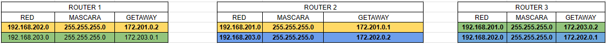

</div>

### Ahora ingresamos los siguientes comandos para configurar Router2:
```bash
  Router> enable
```

```bash
  Router#config t
```

```bash
  Router(config-if)#ip route 192.168.201.0 255.255.255.0 172.201.0.1
```
Donde Direccion de red = 192.168.201.0, MascaraSubRed = 255.255.255.0 y Getaway = 172.201.0.1

### Ruteo del Router2-Router3.
<div align="center">

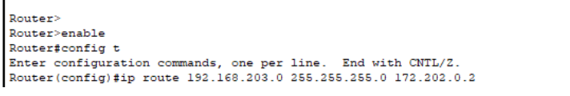

</div

### Ruteo del Router3-Router2.
<div align="center">

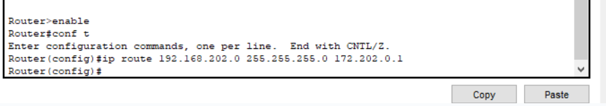

</div

### El ruteo se hace tando del Router2-Router3 como del Router3-Router2 para que tenga conexion.

## 7.0 Envio y recepcion de paquetes.

[](https://www.youtube.com/watch?v=configuroweb)
