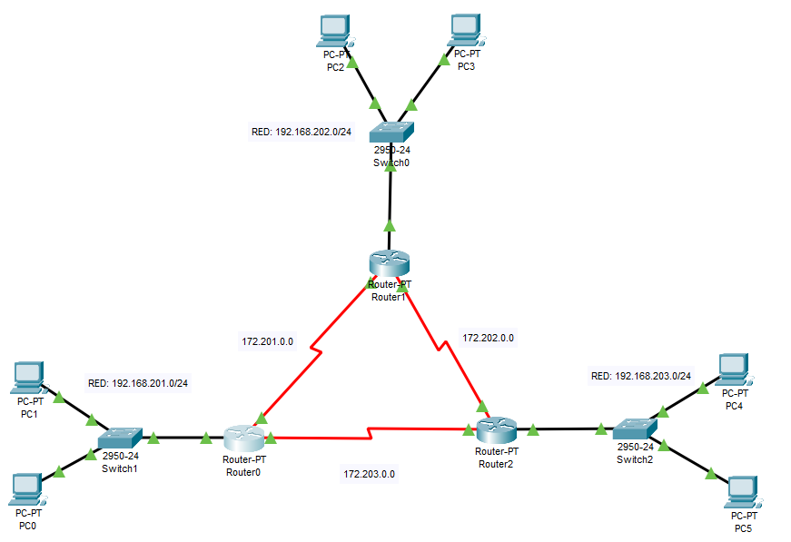
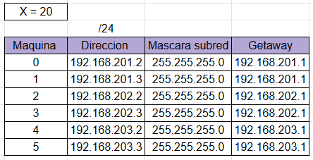

*** 
 
*** 

Universidad de San Carlos de Guatemala
 
Facultad de Ingeniería
 
Escuela de Ciencias y Sistemas
 
Redes de Computadoras 1

    

<h1 align="center" style="font-size: 40px; font-weight: bold;">Practica 2</h1>

   

<h4 align="center" style="font-size: 30px; font-weight: bold;">Grupo 13</h4>

  

| Carnet | Nombre |
| :-: | :-:| 
| 201700770 | Diego Alejandro Juarez Bran |

  

<h4 align="center" style="font-size: 18px; font-weight: bold;">Guatemala 1 de Marzo 2023</h4>

*** 
  
*** 

## Objetivos de la practica.

Que el estudiante de Redes de Computadores 1, aprenda a implementar y  desarrollar una topología de red que utiliza protocolos de capa 2 y capa 3,  configurar ruteo estático y configurar interfaces seriales.

## Desarrollo de la practica

### 1.0 Topologia utilizada

### 2.0 Configuracion de Host
Se configuro cada host/computadora con la siguiente tabla.

Donde x = numeroGrupo + ultimos 2 digitos de carnet -> x = 13 + (7+0) = 20
