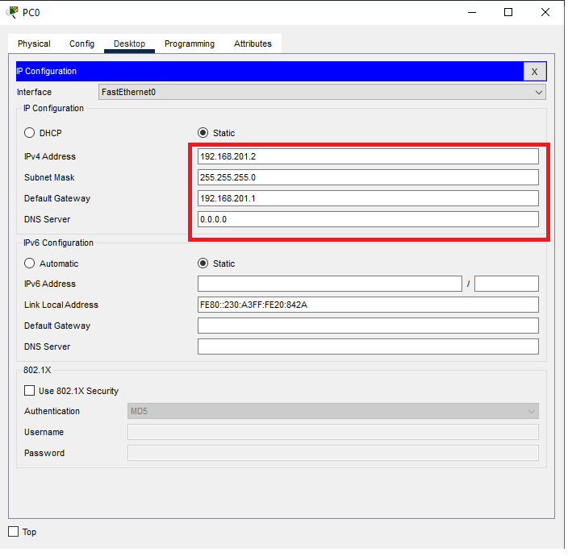

*** 

<br>

*** 

<p style="font-size: 18px">
Universidad de San Carlos de Guatemala
<br>
Facultad de Ingeniería
<br>
Escuela de Ciencias y Sistemas
<br>
Redes de Computadoras 1
</p>

<br><br><br><br>


<h1 align="center" style="font-size: 40px; font-weight: bold;">Practica 2</h1>

<br><br><br>

<h4 align="center" style="font-size: 30px; font-weight: bold;">Grupo 13</h4>

<br><br>


<div align="center">

| Carnet | Nombre |
| :-: | :-:| 
| 201700770 | Diego Alejandro Juarez Bran |


</div>

<br><br>

<h4 align="center" style="font-size: 18px; font-weight: bold;">Guatemala 1 de Marzo 2023</h4>


*** 
<br><br>
*** 

## Objetivos de la practica.

Que el estudiante de Redes de Computadores 1, aprenda a implementar y  desarrollar una topología de red que utiliza protocolos de capa 2 y capa 3,  configurar ruteo estático y configurar interfaces seriales.

## Desarrollo de la practica

### 1.0 Topologia utilizada
<div align="center">


</div>

### 2.0 Configuracion de Host
#### Se configuro cada host/computadora con la siguiente tabla.
<div align="center">


</div>

Donde x = numeroGrupo + ultimos 2 digitos de carnet -> x = 13 + (7+0) = 20

#### Para ingresar a la interfaz se siguen los siguiente pasos: 
<div align="center">


</div>

### Aca configuramos la IP, Getaway y Mascara de subred de cada Host de acuerdo la tabla anterior.
<div align="center">



</div>

### Repetimos este proceso para todos los host de nuestra topologia.


## 3.0 Configuracion de Routers
### Para ingresar a la interfaz del switch seguimos los siguientes pasos:
### Click en el router y luego a la pestaña CLI
<div align="center">


</div>

### Ahora ingresamos los siguientes comandos:
```bash
  Router> enable
```

```bash
  Router#config t
```
```bash
  Router(config)#int fx/x
```
Donde int = interface, f = Fast Ethernet y x/x 
= Puerto donde esta conectado.
```bash
  Router(config-if)#ip address 192.168.201.1 255.255.255.0
```
Donde 192.168.201.1 = getaway y 255.255.255.0 = MascaraSubRed
```bash
   Router(config-if)#no shutdown/shut
```
<div align="center">


</div>

### Esto lo realizamos para cada router tomando en cuenta que el getaway cambia para cada uno.
